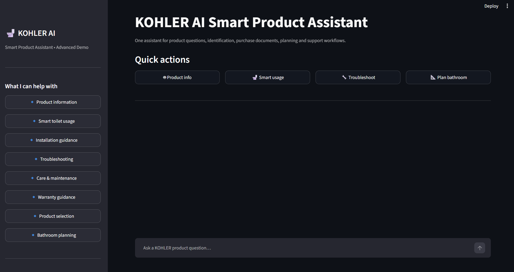
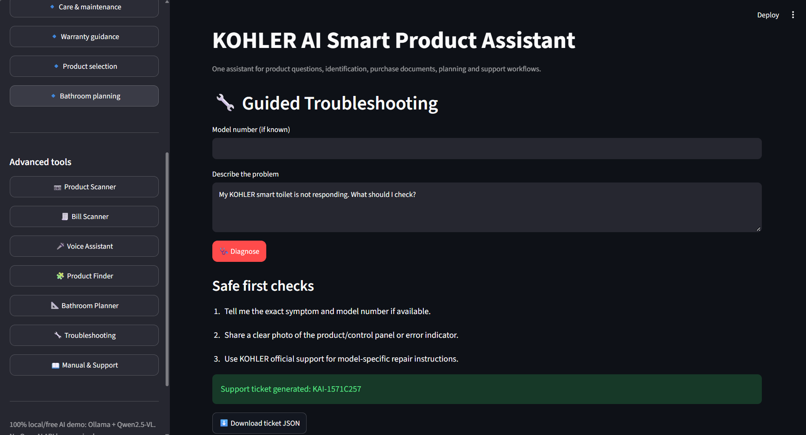
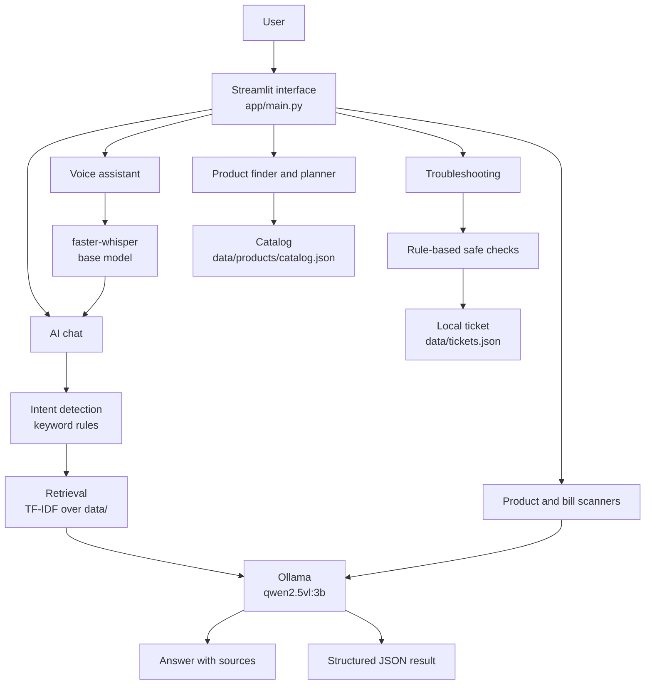

# KOHLER AI Smart Product Assistant

A local, privacy-first AI assistant for KOHLER smart toilets and bidet seats. It answers product
questions from a small knowledge base, identifies products from photos, reads invoices, walks
through troubleshooting and helps shortlist products, all running on your own machine with
open models. No cloud AI service and no API key.


> **Research prototype** built for the KOHLER-MITWPU AI Research Lab Program.
> It is not an official KOHLER application.



---

## Contents

- [Features](#features)
- [Screenshots](#screenshots)
- [How it works](#how-it-works)
- [Tech stack](#tech-stack)
- [Getting started](#getting-started)
- [Configuration](#configuration)
- [Using the app](#using-the-app)
- [Project structure](#project-structure)
- [Extending the knowledge base](#extending-the-knowledge-base)
- [Testing](#testing)
- [Privacy and data handling](#privacy-and-data-handling)
- [Troubleshooting](#troubleshooting)
- [Limitations](#limitations)
- [Roadmap](#roadmap)
- [Disclaimer](#disclaimer)
- [Author](#author)

---

## Features

| Feature | What it does |
| --- | --- |
| **AI chat** | Answers KOHLER product questions using retrieved support documents, keeps the last few messages as context, and shows which documents it used. |
| **Intent detection** | Classifies each question (usage, troubleshooting, warranty, installation, care, purchase) with keyword rules to steer the answer. |
| **Product scanner** | Upload a photo of a product, control panel or label. A local vision model returns the product type, likely model, visible model number and a suggested next step. |
| **Bill scanner** | Upload an invoice image. The vision model extracts the seller, invoice number and date, line items, model numbers and total, as JSON you can download. |
| **Voice assistant** | Upload a recording. It is transcribed locally with `faster-whisper`, then answered by the assistant. |
| **Product finder** | Keyword search over a small demo catalog by category and style, with an optional budget filter. |
| **Bathroom planner** | Enter room dimensions, budget and a style theme to get the room area and a suggested product shortlist. |
| **Guided troubleshooting** | Safe first checks for common symptoms (no power, not flushing, leaking). Running a diagnosis also saves a support ticket locally. |
| **Manual and support finder** | Search the knowledge base and jump to official KOHLER resources. |

---

## Screenshots

### AI chat


### Product scanner


### Bill scanner


### Troubleshooting



<details>
<summary>More screenshots</summary>

**Product scanner result**


**Bill scanner extraction, part 1 and 2**


**Product finder**


**Bathroom planner**


**Manual and support finder**


</details>

---

## How it works



### The chat pipeline

1. **Intent detection** labels the question using keyword rules.
2. **Retrieval** scores every document in `data/` with TF-IDF cosine similarity (unigrams and
   bigrams) blended with keyword overlap, and keeps the top four.
3. **Local model** receives the retrieved text, the last eight messages and the question, with a
   system prompt that forbids inventing models, prices, warranty eligibility, specifications or
   repair procedures, and treats retrieved text as untrusted data.
4. **Response** is shown with the intent and the source documents used.

Requests go to Ollama's local API at `http://127.0.0.1:11434`. Chat runs at temperature 0.2 and
image extraction at 0.1 to keep output steady.

---

## Tech stack

| Layer | Technology |
| --- | --- |
| Interface | Streamlit |
| Language | Python |
| Local AI runtime | Ollama |
| Language and vision model | Qwen2.5-VL 3B (`qwen2.5vl:3b`) |
| Speech to text | faster-whisper (`base` model, CPU, int8) |
| Retrieval | TF-IDF with scikit-learn |
| Configuration | python-dotenv |
| Tests | pytest |

---

## Getting started

### Prerequisites

- Python 3.10 or newer
- [Ollama](https://ollama.com/download) installed and running
- About 3.2 GB of disk space for the model
- Internet access for the first-time downloads only (the Ollama model, and the Whisper model
  when you first use voice)

### 1. Get the code

```bash
git clone https://github.com/kartiksaxena-max/kohler-ai-smart-product-assistant.git
cd kohler-ai-smart-product-assistant
```

### 2. Create a virtual environment and install dependencies

**Windows (PowerShell)**

```powershell
python -m venv venv
.\venv\Scripts\Activate.ps1
python -m pip install -r requirements.txt
```

**macOS / Linux**

```bash
python3 -m venv venv
source venv/bin/activate
python -m pip install -r requirements.txt
```

Activate the environment **before** installing, so the packages land inside it.

### 3. Install the local model

Make sure Ollama is running, then:

```bash
ollama pull qwen2.5vl:3b
```

Check it is installed with `ollama list`.

### 4. Run the app

```bash
python run.py
```

or

```bash
python -m streamlit run app/main.py
```

Open <http://localhost:8501>.

The first answer can take a while because Ollama loads the model into memory. Later answers are
faster.

---

## Configuration

The app runs with sensible defaults. To change them, copy `.env.example` to `.env`:

```bash
cp .env.example .env        # macOS / Linux
copy .env.example .env      # Windows
```

| Variable | Purpose | Default |
| --- | --- | --- |
| `OLLAMA_BASE_URL` | Where the Ollama server is listening | `http://127.0.0.1:11434` |
| `OLLAMA_MODEL` | Model used for chat | `qwen2.5vl:3b` |
| `OLLAMA_VISION_MODEL` | Model used for product and bill images | same as `OLLAMA_MODEL` |
| `OLLAMA_TIMEOUT` | Seconds to wait for a local response | `180` |

`.env` is excluded from Git. Restart the app after editing it.

---

## Using the app

- **AI chat:** use the quick-action buttons or type a question. Each answer shows the detected
  intent, and the latest answer has a **Knowledge sources** panel listing the documents used.
- **Product scanner:** upload a clear, well-lit photo of the product or its model label.
  Always confirm the result against the label or official KOHLER support before ordering parts.
- **Bill scanner:** upload a straight-on, readable invoice. Check every extracted value against
  the original, since a small local model can misread numbers.
- **Voice assistant:** upload a short recording (`wav`, `mp3` or `m4a`). WAV is the most reliable.
- **Product finder:** search by product type or style. Prices show as "verify current regional
  pricing" because the demo catalog has none.
- **Troubleshooting:** describe the problem and select **Diagnose**. Each diagnosis saves a
  ticket to `data/tickets.json` on your computer and offers it as a JSON download. Tickets are
  **not** sent to KOHLER.

---

## Project structure

```text
kohler-ai-smart-product-assistant/
├── app/
│   ├── main.py             # Streamlit interface and page routing
│   ├── ai.py               # Chat: retrieval + Ollama request
│   ├── rag.py              # Document loading, TF-IDF retrieval, intent detection
│   ├── vision.py           # Product and bill image analysis via Ollama
│   ├── voice.py            # Local speech-to-text with faster-whisper
│   ├── catalog.py          # Product catalog search
│   ├── planner.py          # Bathroom concept planner
│   ├── troubleshooting.py  # Rule-based safe first checks
│   ├── tickets.py          # Local support-ticket storage
│   ├── config.py           # Environment configuration
│   ├── logging_config.py   # Logging to logs/app.log
│   └── privacy.py          # Privacy text (not yet linked from the sidebar)
├── data/
│   ├── products/           # catalog.json and product knowledge documents
│   ├── support/            # support and warranty knowledge documents
│   └── policies/           # sample document for testing (not a KOHLER policy)
├── pages/
│   └── 1_Privacy_Policy.py
├── tests/
│   └── test_core.py
├── screenshot_KOHLER/      # README screenshots
├── .env.example
├── requirements.txt
├── run.py                  # Launcher
└── README.md
```

---

## Extending the knowledge base

Add any `.txt` or `.md` file anywhere under `data/`. It is indexed automatically the next time
you ask a question. Start each file with a `SOURCE:` line so it is clear where the content came
from. The included documents are short summaries of publicly available KOHLER support material,
so keep additions factual and traceable to an official source.

To add products, edit `data/products/catalog.json`. Each entry has `name`, `category`, `style`,
`price_inr` (use `null` if unknown), `features` and `source`.

---

## Testing

```bash
python -m pip install pytest
python -m pytest
```

The current tests check that retrieval finds the smart toilet documents and that intent detection
classifies a care question correctly. Coverage is minimal, and the vision, voice and interface
layers are tested by hand.

---

## Privacy and data handling

- **AI runs locally.** Questions, images and audio are processed by Ollama and faster-whisper on
  your computer and are not sent to a cloud AI service.
- **One-time downloads.** The Ollama model and the Whisper model are downloaded once, when first
  installed or used.
- **Stored on your computer:** support tickets (`data/tickets.json`) and a technical log
  (`logs/app.log`). Both are excluded from Git.
- **Uploads** are handled in memory for the selected feature. Audio is written to a temporary
  file only during transcription and deleted afterwards.
- **Sample invoices** used in the screenshots are synthetic. Do not commit real invoices or
  other personal data.

---

## Troubleshooting

| Message or symptom | Fix |
| --- | --- |
| "The free local AI engine is not running" | Start Ollama, then check it with `ollama list`. |
| "The local model ... is not installed" | Run `ollama pull qwen2.5vl:3b`. |
| Requests time out or the first answer is very slow | The model is loading or your hardware is busy. Increase `OLLAMA_TIMEOUT` in `.env`. |
| "Free voice mode needs faster-whisper" | Run `python -m pip install faster-whisper` inside your virtual environment. |
| Voice transcription fails | Use a short WAV file with clear speech. |
| Image analysis fails | Use a sharper, closer photo and confirm the vision model is installed. |
| `ModuleNotFoundError` | Activate the virtual environment, then reinstall with `python -m pip install -r requirements.txt`. |
| Port 8501 is already in use | Run `python -m streamlit run app/main.py --server.port 8502`. |

---

## Limitations

- **Small model.** A 3B-parameter local model can misread invoices, miss details in photos or
  give an imperfect answer. Treat every result as assistive.
- **Small knowledge base.** Four short documents. Questions outside them fall back on general
  model knowledge and official links.
- **Rule-based parts.** Intent detection and troubleshooting use keyword rules, not a trained
  classifier.
- **Demo catalog.** A handful of products with no prices. Availability and details vary by region.
- **Planner is a concept tool.** It uses the room area and style to shortlist products. It does not
  check clearances or produce a layout.
- **Single-user prototype.** No authentication, multi-user support or production monitoring.

---

## Roadmap

- Real-time KOHLER product catalog and pricing integration
- Stronger invoice extraction and OCR
- PDF manual ingestion into the knowledge base
- Clearance checks and a visual layout in the bathroom planner
- Service-center and CRM integration
- Regional (India) product and warranty data

---

## Disclaimer

This repository contains a research and demonstration prototype developed for the KOHLER-MITWPU
AI Research Lab Program. It is not an official KOHLER product and is not endorsed by KOHLER.
KOHLER and related names and logos are trademarks of their respective owners. The sample invoice
shown in the screenshots is synthetic and created for demonstration.

Product specifications, warranty conditions and installation requirements must be verified
against official KOHLER documentation before real-world use. Nothing in this app approves a
warranty claim.

---

## Author

**Kartik Saxena**
B.Tech Computer Science Engineering, MIT World Peace University, Pune
GitHub: [@kartiksaxena-max](https://github.com/kartiksaxena-max)

## License

This project is a research prototype created for educational and demonstration purposes. No
open-source license has been applied yet. Add a `LICENSE` file if you want others to be able to
reuse the code.
